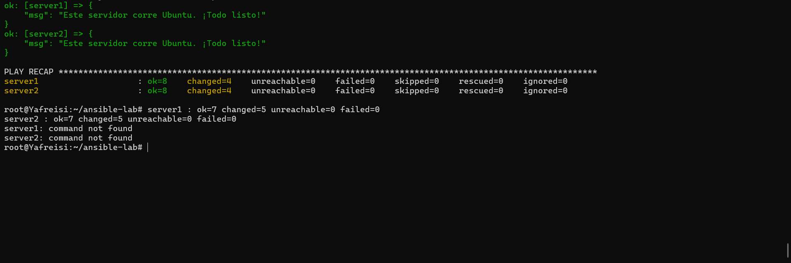

# Laboratorio: Administración de servidores con Ansible y Docker

## Objetivo de la práctica

Configurar un pequeño laboratorio con dos servidores Linux (contenedores Docker
basados en ubuntu:24.04) y administrarlos de forma automatizada usando Ansible.

## Comandos para iniciar los contenedores

```bash
docker compose up -d
docker ps
```

## Comando para ejecutar el playbook

```bash
ansible-playbook -i inventory.ini playbook.yml
```

## Captura de pantalla de la ejecución exitosa


